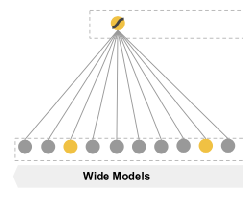
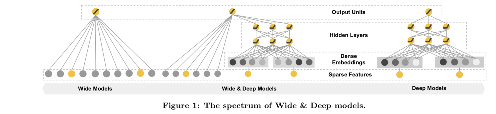

<!-- 显示公式 -->
<head>
    
    
</head>

## 前言

Wide and Deep Learning是Google 2016年发表的论文，是一系列模型的起点，今天我们就来看看这个模型。

Wide and Deep模型由两个部分组成，其一为wide组件，wide组件是广义线性模型。其二为Deep组件，将特征经过Emedding后输入神经网络。最后综合wide组件和Deep组件的输出，得到模型的输出。

---

## Wide组件
WDL模型的Wide组件是形如$y=w\cdot x +b$形式的线性模型，其中$x$是原始特征和变换后特征的集合，其中一种主要的转换特征是交叉特征，即

$$
\phi_k (x) = \prod_{i=1}^d x_i^{c_{ki}} \ \ \   c_{ki} \in \{0,1\}
$$

其中$x_i,i=1,2,\cdots,d$为原始特征，$c_{ki}$表示第$k$个转换特征$\phi_k(x)$是否由原始特征$x_i$构成，即$\phi_k(x)$是由特征集合$\{ x_i | c_{ki} = 1, i=1,2,\cdots,d\}$中所有特征交叉得到。即所有的原始特征为1则得到的变换特征$\phi_k(x)$为1，否则为0。

Wide组件体现了WDL模型的记性性，即训练时的特征取值在预测时出现了，这时对应的参数就会对结果产生影响，如果预测时的某些特征取值在训练时没有出现，则对结果没有影响。

## Deep组件

点击率预估（Click Through Rate Prediction）是指通过一些方法，在广告、商品少量曝光甚至无曝光的情况下来预测该广告、商品的点击率，通常是使用机器学习模型来预测点击率，由于点击率是0到1之间的数值，因此常见的方法是将点击率预测问题看成是二分类问题，因此逻辑回归（Logistic Regression，LR）、支持向量机（Support Vector Machine，SVM），二分类GBDT、xgboost，以及二分类神经网络等模型都可以用来进行点击率预估。

## 种类特征变换

对于电商网站的商品点击率预估问题中，通常有用户特征、商品特征，用户商品交互特征，上下文特征等4类特征。
除了这4种原始特征外，还有使用部分原始特征进行交叉得到的交叉特征。

在原始特征种根据特征的类型可以分成连续的实值特征，比如商品的售价、重量等，此外还有种类特征，比如用户的性别、商品的类目等，对于种类特征，通常可以使用自然数进行编号，但是编号的的数据往往不能表示真实的物理意义。
在实际工程应用中，种类特征会转换为多个0-1特征，比如性别特征gender的取值有male和female两种，进过转换后得到两个特征gender_male、gender_female，这两个特征的取值要么为0，要么为1。通常一个有$d$种取值的种类特征，进过转换后会得到$d$个0-1特征。

## 逻辑回归模型

上面介绍了点击率的概念和一些点击率预估的模型，下面介绍一个简单的逻辑回归模型。

假设原始的特征为$X=[x_1,x_2,\cdots,x_n]$，经过转换后得到的$X'=[x'_1,x'_2,\cdots,x'_m]$，这里的$x'_i,1\leqslant i \leqslant m$要么是连续实值特征，要么是转换后的0-1特征。其中包含了用户的特征和商品的特征，$y$为用户是否点击商品的标签。在逻辑回归模型种，使用下面的方法来计算用户点击商品的概率：

$$
\tilde{y} = \sigma(W\cdot X' + b)
$$

其中$\tilde{y}$是逻辑回归的预测结果，$W=[w_1,w_2,\cdots,w_m]$每个特征对应的权重，$b$为整体的偏置，$\sigma(x)=\frac{1}{1+e^{-x}}$。通过二分类的交叉熵得到损失函数，

$$
l = y \cdot \ln(\tilde{y}) + (1-y) \cdot \ln(1-\tilde{y})
$$

并利用基于梯度的优化算法进行模型优化。

---
[本文背景图片来源，如有侵权请联系我修改。](https://bbs.coloros.com/thread-106169-1-1.html)