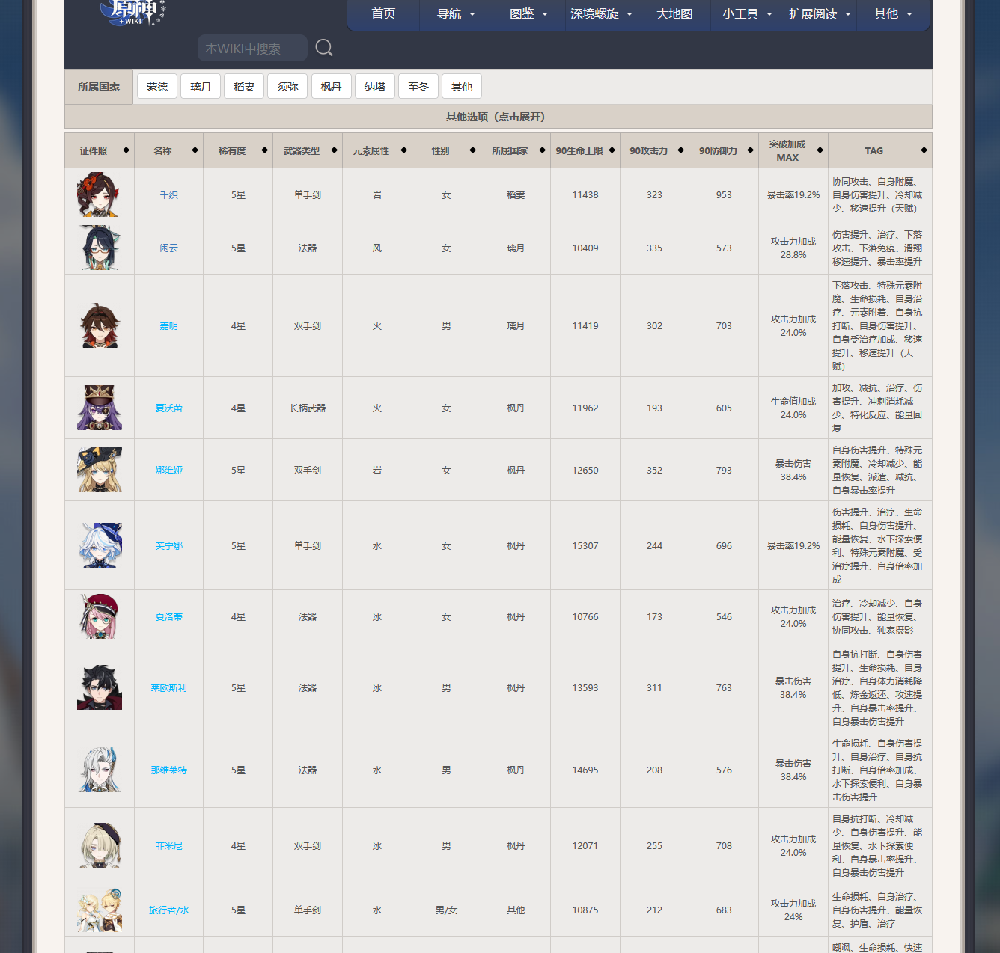
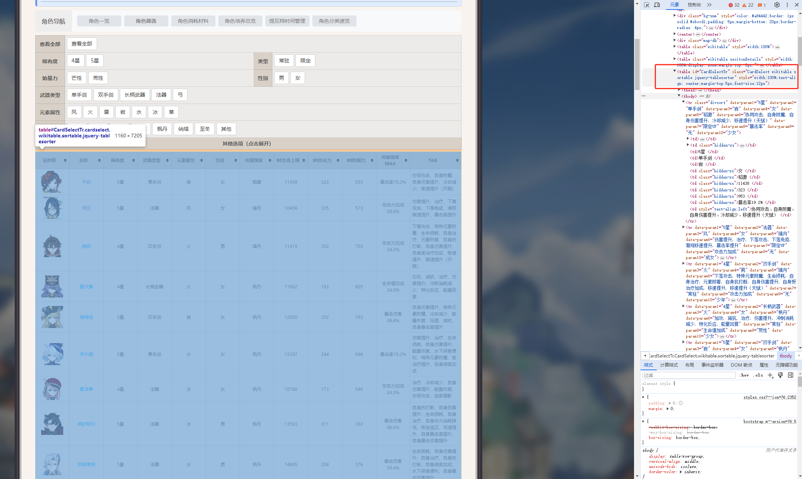

## 前言

最近想用二游的文本来微调大模型，看看能玩出什么有意思的东西。首先得爬取游戏的文本信息，Scrapy是Python爬虫框架，通过阅读文档和博客，很轻松掌握的Scrapy的简单使用，完成爬取数据的目标。

---

### 安装&环境配置

scrapy依赖python环境，可以通过conda创建虚拟环境
```bash
conda create -n venv python=3.10 scrapy
```
顺利安装完成的话，会看见下面的提示

```
# To activate this environment, use
#
#     $ conda activate venv
#
# To deactivate an active environment, use
#
#     $ conda deactivate
```
通过`conda activate venv`命令就可以进入虚拟环境，`conda deactivate`命令用来退出环境。


### 创建项目

scrapy和一般的Python Package不一样，安装之后会提供命令行工具`scrapy`，并使用这个工具来创建爬虫项目。

我们使用startproject子命令来创建项目，项目名为`demo`。
```bash
scrapy startproject demo
```
scrapy会在当前目录下帮我创建一个如下的目录结构，包括爬虫项目的代码和配置。我们的工作是在这些上面进行修改，来完成自己的目标。
```bash
demo
├── demo
│   ├── __init__.py
│   ├── items.py
│   ├── middlewares.py
│   ├── pipelines.py
│   ├── settings.py
│   └── spiders
│       └── __init__.py
└── scrapy.cfg

2 directories, 7 files
```

从`tree demo`结果可以看成，`scrapy.cfg`是项目的配置文件，`demo`子目录里包含了项目代码，`items.py`文件中定义爬虫爬取的目标的字段信息，`pipelines.py`文件里定义了流水线，适合需要多个步骤的项目，`settings.py`是设置文件，比如设置多个流水线的执行优先级，设置是否遵守robots.txt文件的要求等。`spiders.py`子目录里是爬虫的具体代码实现，现在这里没有文件，后续会添加具体的爬虫脚本。

### 实现爬虫


#### 生成爬虫

我们可以使用`genspider`子命令根据模板来生成基础的爬虫脚本，`genspider`子命令有两个参数，分别为爬虫的名字和要爬取数据的网站的url。
```bash
scrapy genspider genshin https://wiki.biligame.com/ys/%E8%A7%92%E8%89%B2%E7%AD%9B%E9%80%89
```
这里我爬取的数据是[BiWiki](https://wiki.biligame.com/)原神版，爬虫名为genshin。这个命令为在`spiders`目录下生成`genshin.py`文件，并载入基础代码。
```bash
demo
├── demo
│   ├── __init__.py
│   ├── items.py
│   ├── middlewares.py
│   ├── pipelines.py
│   ├── settings.py
│   └── spiders
│       ├── __init__.py
│       └── genshin.py
└── scrapy.cfg

2 directories, 8 files
```
`genshin.py`文件中定义了`GenshinSpider`类，其中的`parse`方法就是实现爬虫数据解析的地方，方法的入参`response`是`scrapy`框架请求`start_urls`中的链接返回的响应，我们需要从这个`response`中解析出需要的数据。
```python
import scrapy


class GenshinSpider(scrapy.Spider):
    name = "genshin"
    allowed_domains = ["wiki.biligame.com"]
    start_urls = ["https://wiki.biligame.com/ys/%E8%A7%92%E8%89%B2%E7%AD%9B%E9%80%89"]

    def parse(self, response):
        pass

```
#### 完善逻辑
我们的的目标是将原神biwiki的角色列表的信息都爬取下来，包括角色的名称、稀有度、武器类型等，角色头像不在本文的考虑范围内。



`scrapy`中提供`xpath`，`css`两种选择器来操作html文件中的节点，这里我们使用`xpath`，我们在**千织**这一行鼠标右键，然后选择检查选项（Chrome浏览器），浏览器会打开调试工具。

通过在调试工具的元素tab中移动鼠标，可以在左边观察到不同节点对应的网页内容。很容易发现我们需要的角色都在一个`table`元素里面，这个`table`元素具有`id="CardSelectTr"`，表头信息在`table`下的`thead`标签下，角色信息在`tbody`标签下，在`tbody`标签下，有多个`tr`标签，每个`tr`标签对应一个角色，`tr`标签下有多个`td`标签，每个`td`标签都有一项数据。我们的目标是将这些数据提取出来。



我们可以使用`//table[@id='CardSelectTr']`这个`xpath`选择器来定位整个表格，在`//table[@id='CardSelectTr']`的后面添加`/tbody`可以定位表格的`tbody`部分，再添加`/tr`就能选择所有的角色了，合并起来就是`//table[@id='CardSelectTr']/tbody/tr`。

为了把所有的角色的信息都爬下来，我可以使用`for`循环来处理每个角色，`response.xpath()`函数的返回值为**SelectorList**，是经过特殊封装的**List**，内部元素类型为**Selector**，所以在`for`循环的内部，我们还可以继续使用`character.xpath()`来选择对象，比如`character.xpath("td[2]")`就可以选择角色的*名称*，对应的是
`<td class="hidden-xs xh-highlight"><a href="/ys/%E5%8D%83%E7%BB%87" title="千织">千织</a></td>`这个html元素，通过添加`/a`可以选择链接标签，再添加`/text()`可以选择到`a`标签内部的文本，合并起来就是`td[2]/a/text()`。

这时`character.xpath("td[2]/a/text()")`返回的还是**SelectorList**，正常情况下列表内应该只有一个**Selector**元素，我们需要将这个**Selector**转换为文本，这个可以通过调用`extract_first()`方法来完成。将结果用`dict`和`list`存储起来，最后等`for`循环结束后，再将结果返回。
```python
import scrapy


class GenshinSpider(scrapy.Spider):
    name = "genshin"
    allowed_domains = ["wiki.biligame.com"]
    start_urls = ["https://wiki.biligame.com/ys/%E8%A7%92%E8%89%B2%E7%AD%9B%E9%80%89"]

    def parse(self, response):
        characters = response.xpath("//table[@id='CardSelectTr']/tbody/tr")
        result = []
        for character in characters:
            # 处理异常数据
            if not character.xpath("td"):
                continue
            data = dict()
            name = character.xpath("td[2]/a/text()").extract_first().strip()
            data["name"] = name
            rarity = character.xpath("td[3]/text()").extract_first().strip()
            data["rarity"] = rarity
            weapon = character.xpath("td[4]/text()").extract_first().strip()
            data["weapon"] = weapon
            element = character.xpath("td[5]/text()").extract_first().strip()
            data["element"] = element
            gender = character.xpath("td[6]/text()").extract_first().strip()
            data["gender"] = gender
            country = character.xpath("td[7]/text()").extract_first().strip()
            data["country"] = country
            hp = character.xpath("td[8]/text()").extract_first().strip()
            data["HP"] = hp
            att = character.xpath("td[9]/text()").extract_first().strip()
            data["ATT"] = att
            defence = character.xpath("td[10]/text()").extract_first().strip()
            data["DEF"] = defence

            result.append(data)
            
        return result

```

#### 运行爬虫

完成上面的步骤后，在`demo`项目目录下，通过执行`crawl`子命令就可以运行爬虫。
```bash
scrapy crawl genshin
```
这个命令可以让爬虫去爬取数据，在命令行的日志中也能看到具体的数据。不过还没办法把数据保存下来，为了保持数据，可以添加`-o`或`-O`参数并提供文件名来保存数据。
```bash 
# 保存json格式
scrapy crawl genshin -O character.json
# 保存jsonl格式
scrapy crawl genshin -O character.jsonl
# 保存csv格式
scrapy crawl genshin -O character.csv
```
执行过后，在`demo`项目目录里就会看见保存的数据。
```bash 
demo
├── characters.csv
├── characters.json
├── characters.jsonl
├── demo
│   ├── __init__.py
│   ├── __pycache__
│   │   ├── __init__.cpython-310.pyc
│   │   └── settings.cpython-310.pyc
│   ├── items.py
│   ├── middlewares.py
│   ├── pipelines.py
│   ├── settings.py
│   └── spiders
│       ├── __init__.py
│       ├── __pycache__
│       │   ├── __init__.cpython-310.pyc
│       │   └── genshin.cpython-310.pyc
│       └── genshin.py
└── scrapy.cfg

4 directories, 15 files
```